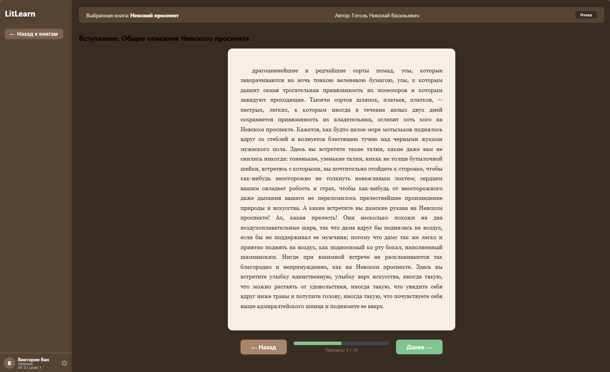
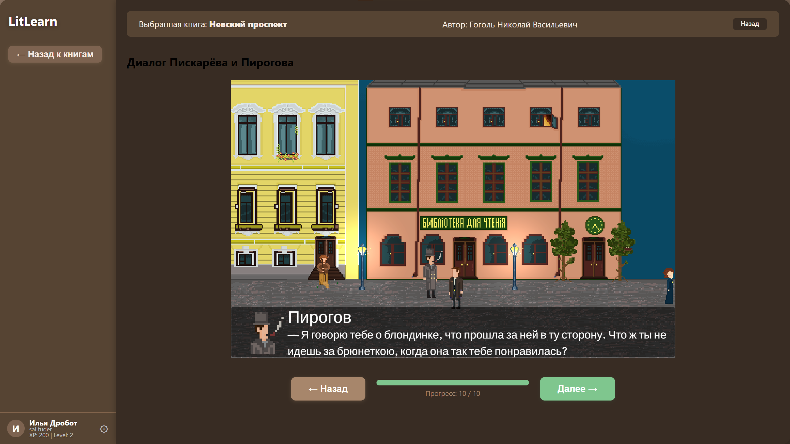
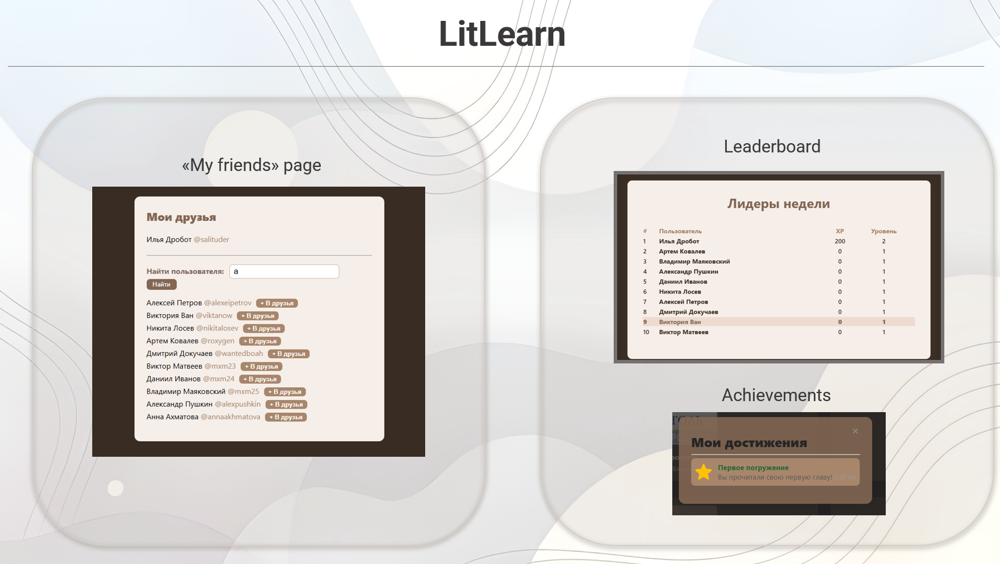

🇬🇧 English
# LitLearn — Interactive Literature Learning Platform with Gamification

**LitLearn** is a graduation thesis project (Bachelor’s degree, program 09.03.04 — Software Engineering) developed at Rostov State University of Economics (RSUE).
It is a modern educational platform for students and teachers, combining reading of literary works, mini-games, quizzes, achievements, chat, and progress analytics. This project was developed using React, Node.js, Electron, MongoDB, and Unity WebGL.

## Key Features

- 📚 **Interactive book reading** — each chapter can include text, a quiz, or a mini-game.
- 🏆 **Gamification** — XP system, levels, achievements, leaderboard.
- 🎮 **Unity WebGL mini-games** — game scenes integrated directly into the app.
- 💬 **Chat and friends** — built-in messenger, friend search and management.
- 👩‍🏫 **Teacher mode** — create/manage classes, assign books, view student progress and statistics.
- 📈 **Analytics** — track progress, activity, automatic reports.
- 🔒 **Security** — server-side data storage, JWT authentication, password hashing.
- 🖥 **Cross-platform** — works on Windows, macOS, Linux (via Electron), browser support.

## Technologies

- **Frontend:** React, TypeScript, Electron
- **Backend:** Node.js, Express, MongoDB, Socket.io
- **Mini-games:** Unity WebGL
- **Testing:** Jest, React Testing Library

## Getting Started

1. Clone the repository:
   ```sh
   git clone https://github.com/yourusername/literalearn-app.git
   cd literalearn-app
   ```

2. Install dependencies:
   ```sh
   cd server
   npm install
   cd ../client
   npm install
   ```

3. Start the server:
   ```sh
   cd ../server
   npm start
   ```

4. Start the client (React/Electron):
   ```sh
   cd ../client
   npm run dev
   ```

5. Open the app in your browser at [http://localhost:3000](http://localhost:3000)  
   Or use Electron for the desktop version.

## Screenshots
Dashboard

Book reading and in-book mini-game

Unity game scene (that included in book learning process) by chapter

Achievements and leaderboard


## More

- [Thesis text (in Russian)](текст_диплома.txt) — detailed description of architecture, analysis, testing, and economic efficiency.
- [Sample Unity WebGL mini-game](client/public/unity/scene1/)

## Authors

- Ilya Drobot (Rostov State University of Economics)
- Scientific advisor: E.A. Arapova

---

**LitLearn — making literature engaging!**

🇷🇺 Русский
# LitLearn — Веб-приложение для интерактивного изучения литературы с геймификацией

**LitLearn** — это выпускная квалификационная работа (ВКР, бакалавриат по направлению 09.03.04 — Программная инженерия), выполненная в РГЭУ (РИНХ) — Ростовском государственном экономическом университете. Это современная образовательная платформа для школьников и учителей, сочетающая чтение художественной литературы, мини-игры, квизы, достижения, чаты и аналитику прогресса. Проект реализован как дипломная работа на стеке React, Node.js, Electron, MongoDB и Unity WebGL.

## Ключевые возможности

- 📚 **Интерактивное чтение книг** — каждая глава может содержать текст, квиз или мини-игру.
- 🏆 **Геймификация** — система XP, уровней, достижений, лидерборд.
- 🎮 **Мини-игры на Unity WebGL** — интеграция игровых сцен прямо в приложение.
- 💬 **Чаты и друзья** — встроенный мессенджер, поиск и добавление друзей.
- 👩‍🏫 **Режим учителя** — создание и управление классами, назначение книг, просмотр статистики и прогресса учеников.
- 📈 **Аналитика** — отслеживание прогресса, активности, автоматические отчёты.
- 🔒 **Безопасность** — хранение данных на сервере, JWT-аутентификация, шифрование паролей.
- 🖥 **Кроссплатформенность** — работает на Windows, macOS, Linux (через Electron), поддержка браузера.

## Технологии

- **Frontend:** React, TypeScript, Electron
- **Backend:** Node.js, Express, MongoDB, Socket.io
- **Мини-игры:** Unity WebGL
- **Тестирование:** Jest, React Testing Library

## Как запустить

1. Клонируйте репозиторий:
   ```sh
   git clone https://github.com/yourusername/literalearn-app.git
   cd literalearn-app
   ```

2. Установите зависимости:
   ```sh
   cd server
   npm install
   cd ../client
   npm install
   ```

3. Запустите сервер:
   ```sh
   cd ../server
   npm start
   ```

4. Запустите клиент (React/Electron):
   ```sh
   cd ../client
   npm run dev
   ```

5. Откройте приложение в браузере по адресу [http://localhost:3000](http://localhost:3000)  
   Или используйте Electron для десктоп-версии.

## Скриншоты

Главный экран

Чтение книги и мини-игра

Unity сцена по книге (главе)

Достижения и лидерборд


## Подробнее

- [Текст диплома (PDF)](текст_диплома.txt) — подробное описание архитектуры, анализа, тестирования и экономической эффективности.
- [Пример мини-игры на Unity WebGL](client/public/unity/scene1/)

## Авторы

- Дробот Илья Александрович (РГЭУ (РИНХ))
- Научный руководитель: Е.А. Арапова

---

**LitLearn — делаем литературу интересной!**
